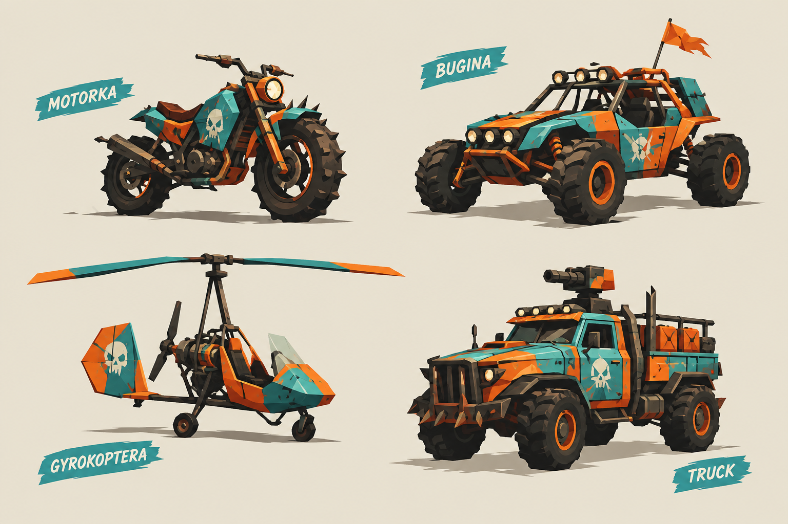
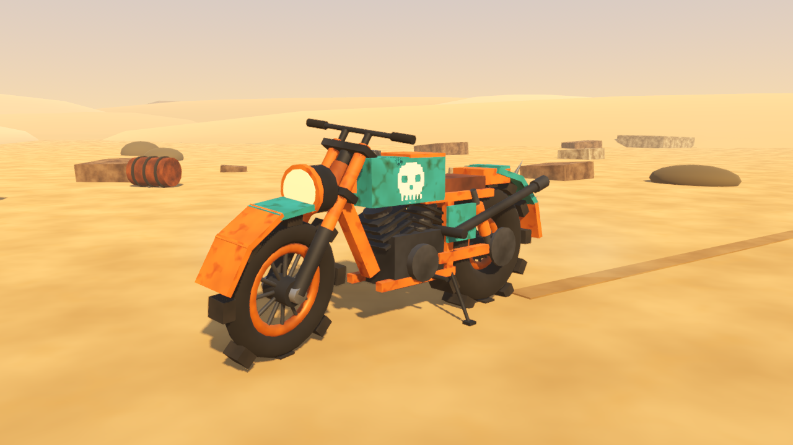
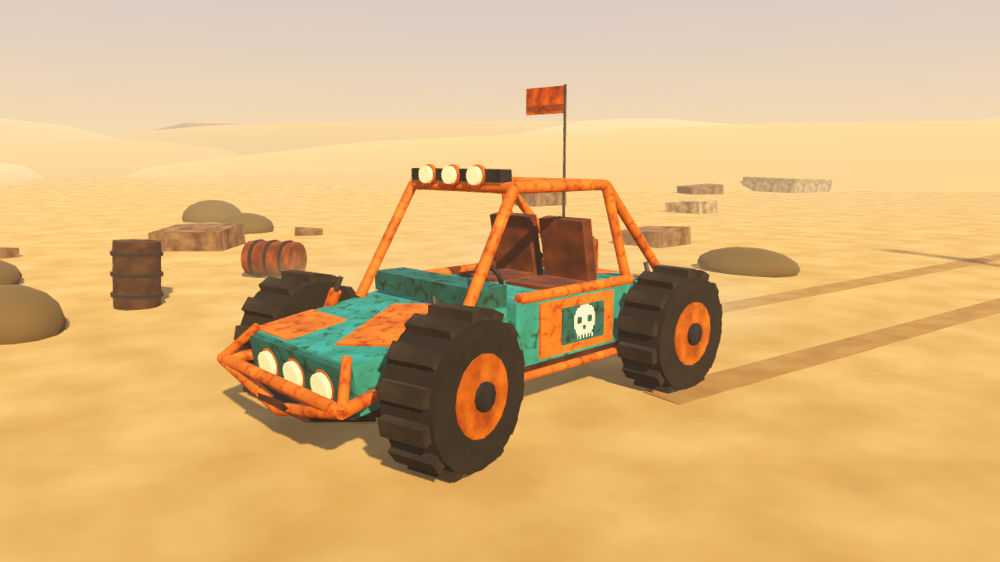
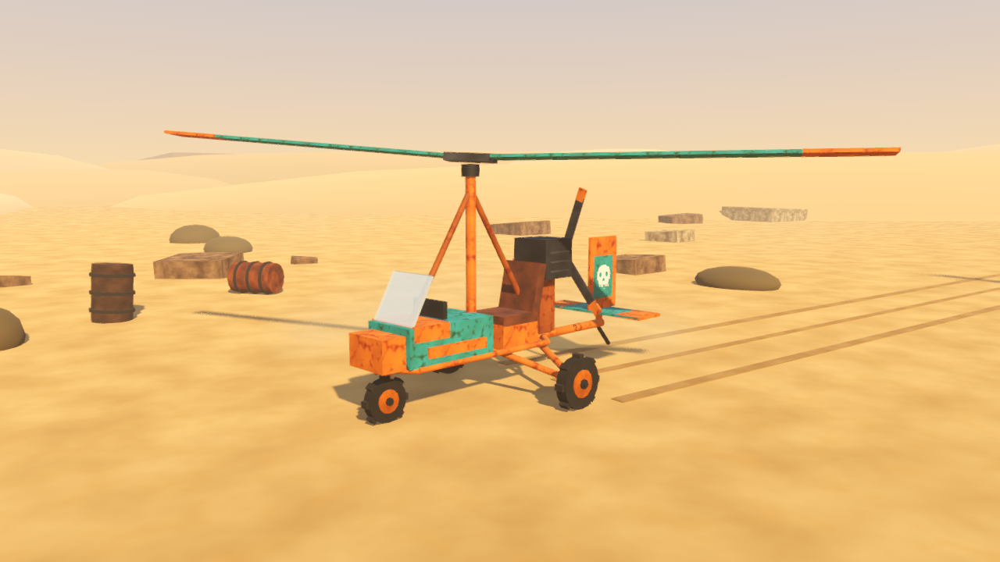
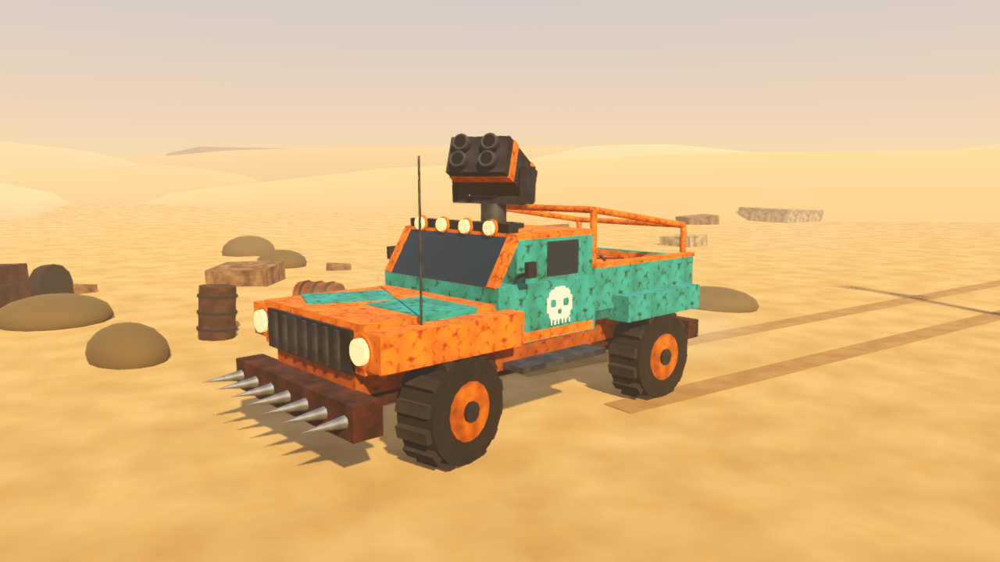
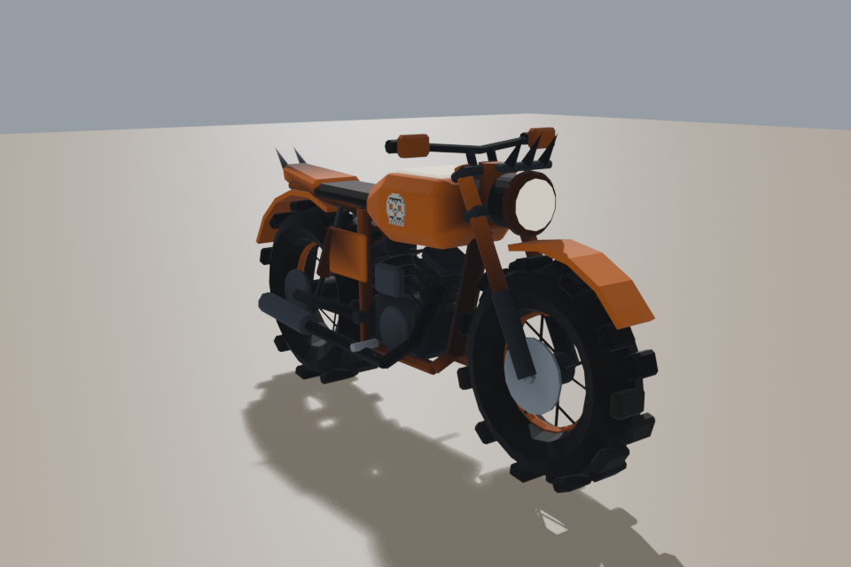
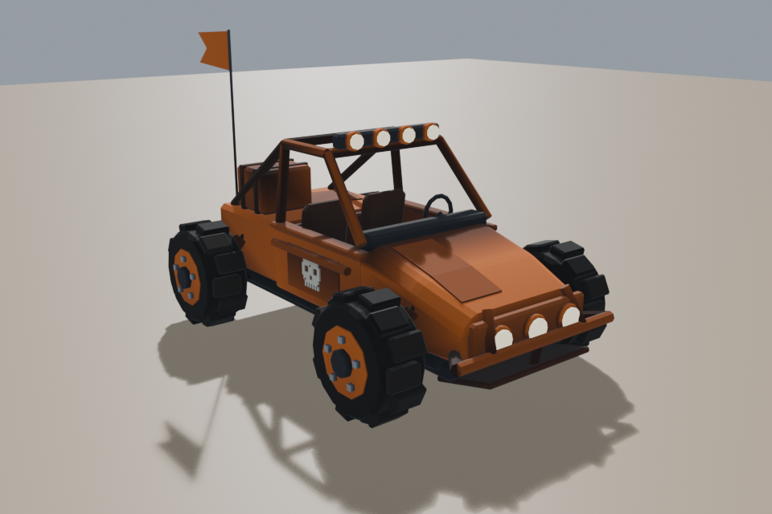
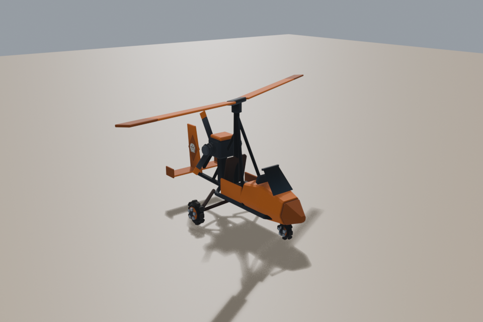
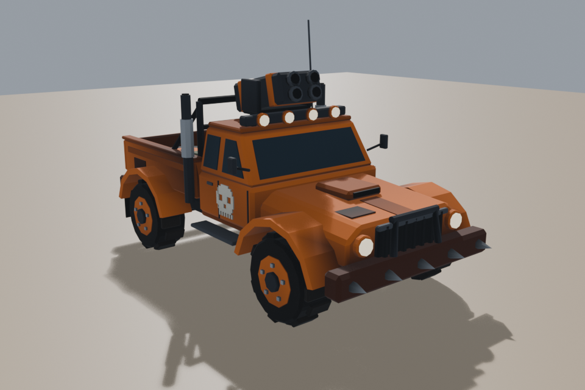

# Wasteland Fire

A two-player split-screen 3D vehicle game for one keyboard and one couch, in
the spirit of Return Fire (1995). Drive wasteland Motorbikes, Buggies, Trucks
and Gyrocopters, steal the other Player's Flag and haul it home on a Motorbike
before your Fuel runs dry and your Tokens run out.

Built in Godot 4.7.2 with GDScript. A hobby project, made for playing with
friends at home.



## How it plays

- Two Players share one keyboard and one screen, split side by side.
- Each Player spawns Units from the Garage at their Base, paying one Token of
  that type per spawn. The Map sets the Token stock.
- Four Units. The Motorbike is fast, weak and the only one that can carry a
  Flag. The Buggy beats the Truck, the Truck beats the Gyrocopter and the
  Gyrocopter beats the Buggy. Only the Gyrocopter crosses cliffs and water.
- Every Unit burns Fuel while moving. Fuel Cans on the Map refill it.
- Each Base keeps its Flag in a box of four Flag Walls under its water tower.
  A Buggy, a Truck or a Gyrocopter breaks one with its Shots (the Motorbike's
  Shots do nothing to it); a hit wall looks damaged, darker and cracked with
  chunks at its foot, and worse below about a third of its strength. Once one
  falls, and both Turrets of that Base are down, a Motorbike can drive in and
  take the Flag. The Gyrocopter flies over the walls but cannot carry. A broken
  Flag Wall stays down until the Round is played again.
- Two Turrets stand outside each Gate, one on each side. They shoot only at the
  other Player's Unit, aim ahead of it where it will be, and need a clear line
  of sight; every Unit's Shots hurt them (20 Motorbike Shots break one) and
  they cannot be built or taken. While either Turret of a Base stands the other
  Player cannot take that Base's Flag: their view says "Destroy the turrets
  first" while their Motorbike touches it. A broken Turret stays down until the
  Round is played again.
- The Truck lays Mines, five a Truck: one press of its lay key drops one just
  behind its tail. A new Mine blinks in its owner's Team colour for 3 seconds
  and is harmless; then it shines steadily and is live, and destroys any ground
  Unit that drives onto it at once, a full Truck and its owner's own Unit
  included, in a short flash. The Gyrocopter flies over Mines and Shots never
  set them off. A Mine cannot be laid in or near a Base (the yard, and about
  10 m in front of each Gate) or where it would not lie on open ground (a wall,
  the cover, a tank, a cliff, water): the Player's view says why for a moment.
  A Mine stays when its Truck is destroyed, and a Round played again starts
  with none.
- Win by delivering the opponent's Flag to your own Base. Lose by losing your
  last Motorbike, because without one you can never carry a Flag.

The rules of record are in `design/rules.md`, the one-page brief in
`design/game-brief.md` and the vocabulary in `CONTEXT.md`.

## Status

| Story | What | State |
|---|---|---|
| 001 | Driving toy: one Motorbike, chase camera, arcade kinematic driving | Done |
| 002 | Split screen for two, one fixed keyboard layout per Player | Done |
| 003 | Bases, destruction and respawn, self-destruct | Done |
| 004 | The Flag and the win, per-Player HUD, round-over screen | Done |
| 005 | Four Units and the counter triangle | Done |
| 006 | Fuel and Fuel Cans | Done |
| 007 | Map 01 with the Team colours | Done |
| 008 | Tokens, the Garage and the loss | Done |
| 009 | Playtest quick fixes: solid depot tanks, the Gyrocopter over the cover, turning on the spot, slower Fuel burn standing, the out-of-Fuel hint | Done |
| 010 | The camera from above, with a key back to the chase view | Done |
| 011 | The Unit swap at the own Base | Done |
| 012 | Flag Walls: a box of four breakable walls around each Flag, which look damaged as they take hits; new Units appear on the Garage's side spots | Done |
| 013 | Turrets: two per Base outside the Gate that shoot at the other Player's Unit; no Flag can be taken while one of its Base's Turrets stands | Done |
| 014 | The Truck's Mines: five per Truck, laid with E or Comma, live after 3 s, destroying any ground Unit that drives onto them; never laid in or near a Base | Done |

Map 01 and the four Units have their low-poly look: the Map is built from
Godot's built-in meshes with textures generated in code, lit by a low warm sun
under a desert sky with ambient occlusion and anti-aliasing, and the Units are
models built in Blender from the concept sheet by the scripts in
`tools/blender/` (since 2026-10-10; the concept kit under `assets/art/` they
replaced stays as a fallback). The older evidence scenarios still run on the
greybox field.

## Controls

| | Player 1 | Player 2 |
|---|---|---|
| Throttle / reverse | W / S | Up / Down |
| Steer | A / D | Left / Right |
| Fire | Space | Period |
| Choose a Unit (previous / next) | A / D | Left / Right |
| Confirm the Unit | Space | Period |
| Self-destruct | Tab | Enter |
| Lay a Mine (Truck) | E | Comma |
| Switch the camera view | Q | Slash |

Each Player chooses a Unit type at the start of a Round and after every
destruction, with the choice panel at the bottom of their own view. R restarts
from the round-over screen.

A Round starts in the view from above: the camera stands high over your Unit,
tilted a little forward so you see more ground ahead than behind, and turns
with the Unit. The camera key switches your own view, at any time, between that
and the chase camera from behind; the other Player's view does not change, and
your choice stays through a restart. The tops of the water towers are not drawn
in the view from above, so the Flag on its seat and the Unit that takes it
stay in sight.

Each Player has a stock of Tokens for every Unit type; Map 01 gives both of
them Motorbike 5, Buggy 3, Truck 2 and Gyrocopter 2. A destroyed Unit costs one
Token of its type, taken when it is destroyed: enemy fire, a Self-destruct and
a Gyrocopter's empty-tank crash all count. The choice panel shows how many
Tokens each type has left and dims a type with none, which the cursor skips;
the HUD shows your Motorbike Tokens, counting the Motorbike you are driving. A
Round ends when a Player delivers the other's Flag, or when a Player's last
Motorbike Token is gone: that Player loses. If both lose their last one on the
same tick, nobody wins and the screen says so. R starts the Round again with
full stocks.

Keys 1 and 2 used to damage each Player's own Unit for testing; they are off
now that weapons exist, and `debug_damage` in
`src/gameplay/match/data/match_rules.tres` brings them back.

Every Unit spawns with half a tank. The amber Fuel gauge beside the hit points
empties while the Unit moves and holds while it stands still. Drive over an amber
Fuel Can to refill from it; the Can comes back at the same spot after about 20
seconds. A ground Unit with no Fuel stops but can still turn and fire, and a
Gyrocopter with no Fuel crashes. Self-destruct still works with an empty tank.

Map 01 is an island about 300 by 100 metres. Orange is Player 1 at the west
Base and Teal is Player 2 at the east Base; each Base is a walled compound with
one gate facing the centre, a roofless Garage and a water tower over the Flag.
A canyon road runs along the north and a cracked salt flat fills the middle,
with a Fuel depot of five Cans at its centre and wrecks, containers and scrap
walls for cover. Two shallow fords across the flat slow ground Units to half
speed. A rocky ridge in the south, cut by two channels, is crossed only by the
Gyrocopter, and the sea around the island stops every Unit.

## Running it

1. Install Godot 4.7.2. The project is pinned to that version; see
   `docs/engine-reference/godot/VERSION.md`.
2. Open the project folder in the editor and press Play, or from the repo
   root:

```
godot --path .
```

The game launches straight into the split screen. There is no menu yet.

Tests use gdUnit4 and run headless. The same suite runs in GitHub Actions on
every push:

```
godot --headless -s -d --remote-debug tcp://127.0.0.1:0 res://addons/gdUnit4/bin/GdUnitCmdTool.gd -a res://tests --ignoreHeadlessMode
```

## Repository layout

- `src/gameplay/` is the game: units, match rules, split screen, maps, chase
  camera and the Flag. `src/ui/hud/` is the HUD.
- `tests/` holds the gdUnit4 tests.
- `design/` holds the brief, the rules of record and the author's Slovak
  source with its English translation.
- `production/` holds the epic, the stories and the retained QA evidence, one
  folder of screenshots per story.
- `assets/art/` holds the vehicle concept models, a shared palette and a
  showcase scene that renders them, and the Units' Blender models (`.glb`)
  with their preview renders.
- `tools/blender/` holds the Python scripts that build the Units' models in
  Blender; `tools/evidence/` the evidence harness.
- `docs/` holds engine reference notes pinned to Godot 4.7.2 and the
  framework's workflow guide.
- `.claude/` holds the agents, skills and hooks of the development framework
  described below.

## Concept art

Four vehicles in one kit, kitbashed from Godot's built-in meshes with
procedural rust and paint-chip textures, rendered by the engine itself.

| Motorbike | Buggy |
|---|---|
|  |  |

| Gyrocopter | Truck |
|---|---|
|  |  |

The models in the game, built in Blender from the same sheet in one Team colour
(here Player 1's orange), by the scripts in `tools/blender/`:

| Motorbike | Buggy |
|---|---|
|  |  |

| Gyrocopter | Truck |
|---|---|
|  |  |

## How it is made

The project is developed with [Claude Code](https://claude.com/claude-code)
inside [Claude Code Game Studios](https://github.com/Donchitos/Claude-Code-Game-Studios)
by Donchitos, a studio-shaped set of agents, skills and quality gates for
Claude Code. The framework turns the work into stories with acceptance
criteria, reviews and retained evidence. The design, the decisions and the
playtesting are the author's.

## Credits and licence

- Game design, code and art: copyright 2026 Tomas Kunzo. A licence for the
  game's own content has not been chosen yet.
- Development framework: Claude Code Game Studios by Donchitos, MIT licence,
  see `LICENSE`.
- Test framework: gdUnit4 by Mike Schulze, MIT licence, see
  `addons/gdUnit4/LICENSE`.
- Inspiration: Return Fire (1995). No code or assets from it are used.
